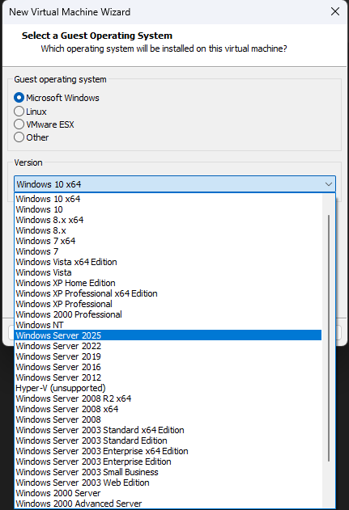
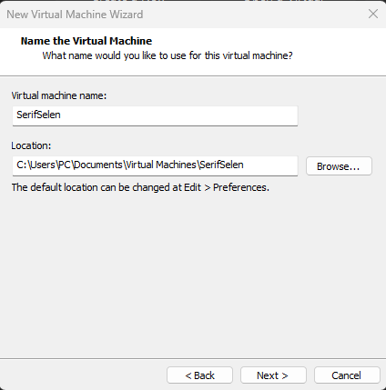
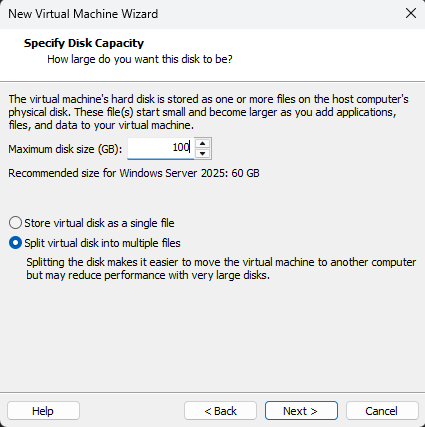
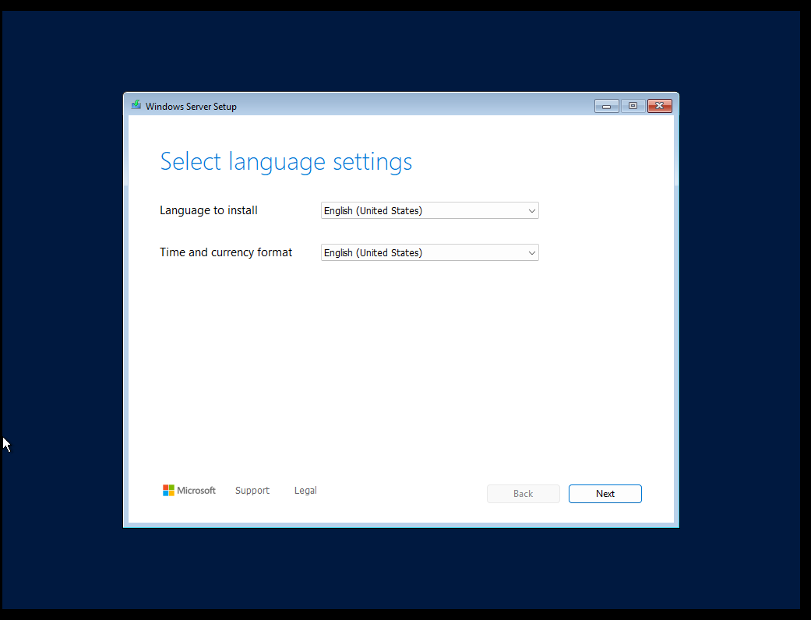
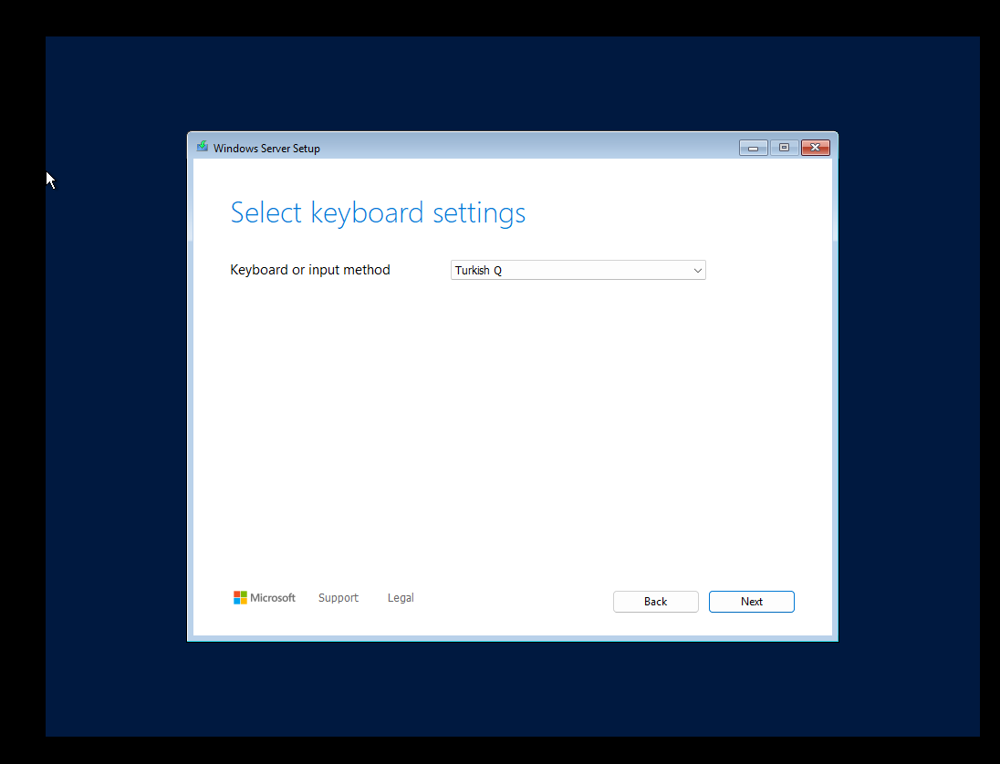
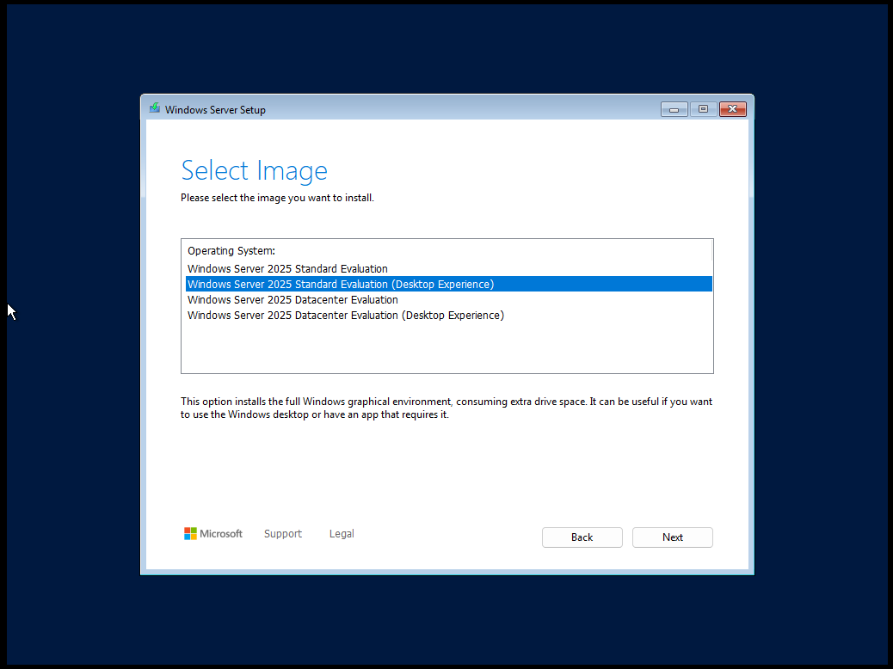
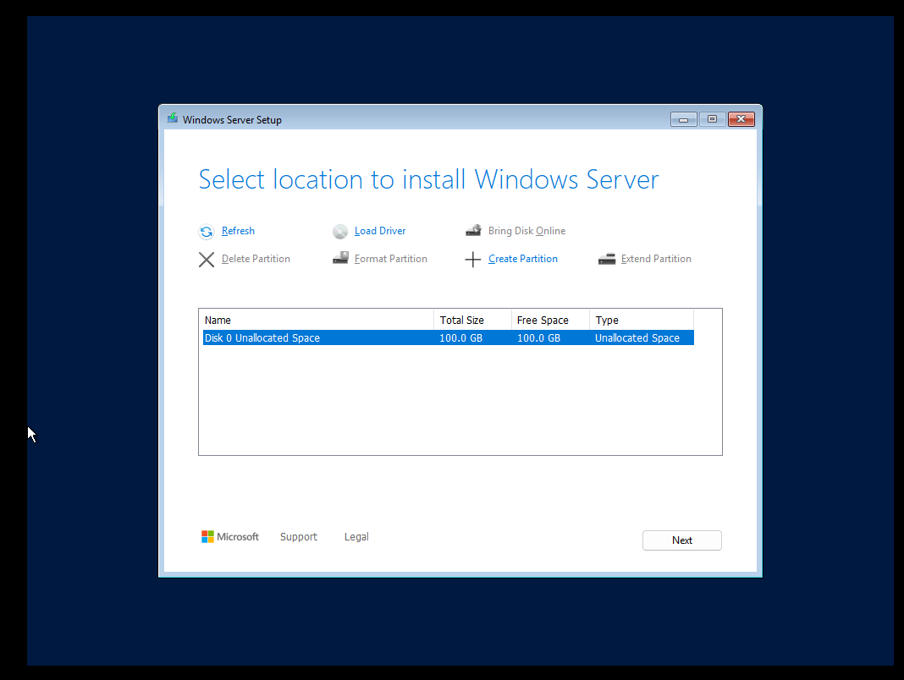
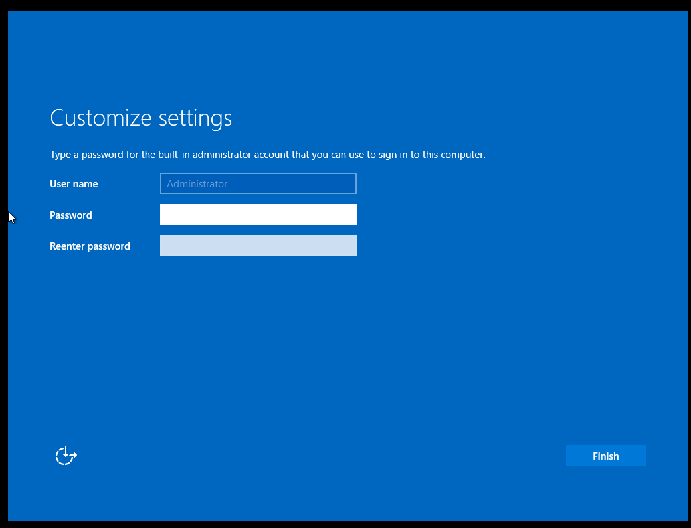

# 🚀 Windows Server 2025 Kurulum Rehberi: Adım Adım Sanal Makine Kurulumu

> **Not:** Bu rehber, *Windows Server 2025 Technical Preview* sürümü için hazırlanmıştır. Resmi sürüm henüz yayımlanmamıştır (2023 itibarıyla).

---

## 🔧 Adım 1: VMware Workstation Pro 17 ile Yeni Sanal Makine Oluşturma


**Açıklama:**  
Bu ekran, **VMware Workstation Pro 17** başlangıç arayüzünü gösterir. Sol tarafta "Library" paneli, ortada ise 3 temel seçenek bulunur:
- `Create a New Virtual Machine` (Yeni Sanal Makine Oluştur)
- `Open a Virtual Machine` (Mevcut Sanal Makineyi Aç)
- `Connect to a Remote Server` (Uzak Sunucuya Bağlan)

**Nasıl Devam Edilir?**  
1. `Create a New Virtual Machine` butonuna tıklayın.  
2. Kurulum sihirbazı açılacaktır → Sonraki adımda ISO dosyası ekleyeceğiz.

> 💡 **Blog İpucu:**  
> Okuyuculara "Neden bu adımı yaptık?" sorusuna cevap verin. Örneğin:  
> *"Sanal makine oluşturmadan önce, Windows Server 2025'in çalışacağı izole bir ortam gereklidir. VMware bu izolasyonu sağlar."*

---

## 🔧 Adım 2: Kurulum Sihirbazı Başlatma


**Açıklama:**  
"Create a New Virtual Machine" seçeneği tıklandıktan sonra **"New Virtual Machine Wizard"** açılır. Burada kurulum tipini seçeceğiz.

**Nasıl Devam Edilir?**  
1. `Typical (Recommended)` seçeneğini işaretleyin.  
2. **Next** butonuna tıklayın.

> ⚠️ **Önemli Uyarı:**  
> İleri düzey kullanıcılar için `Custom (Advanced)` seçeneği, disk sürücü ayarlarını özelleştirmenize izin verir.

---

## 🔧 Adım 3: ISO Dosyası Seçimi


**Açıklama:**  
Bu adımda, Windows Server 2025 kurulum dosyası olan **ISO** dosyasını ekleyeceğiz.

**Nasıl Devam Edilir?**  
1. `Installer disc image file (iso)` seçeneğini işaretleyin.  
2. **Browse** butonuna tıklayıp indirdiğiniz ISO dosyasını seçin.  
3. **Next** butonuna tıklayın.

> 📌 **Önemli Not:**  
> ISO dosyasını henüz indirmediyseniz, Microsoft'un resmi **Insider Program** sayfasından indirebilirsiniz.

---

## 🔧 Adım 4: Sistem Tipi Seçimi


**Açıklama:**  
Windows Server 2025 için **"Microsoft Windows"** ve sürüm seçimi yapılır.

**Nasıl Devam Edilir?**  
1. `Guest OS version` kısmından **"Windows Server 2025"** seçeneğini işaretleyin.  
2. **Next** butonuna tıklayın.

> 💡 **Blog İpucu:**  
> Sürüm seçimi yanlış yapılacak olursa, sanal makine performansı etkilenebilir. Daima en uygun sürümü seçin!

---

## 🔧 Adım 5: Sanal Makine Adı ve Konumu


**Açıklama:**  
Sanal makinenizin adını ve depolanacağı klasörü seçtiğiniz ekran.

**Nasıl Devam Edilir?**  
1. **Virtual machine name** kısmına `Windows-Server-2025` yazın.  
2. **Browse** ile kaydedilecek klasörü seçin.  
3. **Next** butonuna tıklayın.

> 📁 **Organizasyon Tavsiyesi:**  
> Tüm sanal makineler için ayrı bir klasör oluşturun (Örn: `C:\VMs\Windows-Server-2025`).

---

## 🔧 Adım 6: Disk Kapasitesi Ayarlama


**Açıklama:**  
Windows Server 2025'in çalışacağı sanal diskin boyutunu ayarladığınız ekran.

**Nasıl Devam Edilir?**  
1. **Maximum disk size** kısmına `120 GB` girin (en az).  
2. `Split virtual disk into multiple files` seçeneğini işaretleyin.  
3. **Next** butonuna tıklayın.

> ⚙️ **Teknik Detay:**  
> Disk boyutunu artırmanız, future-proof (geleceğe dönük) bir kurulum sağlar. 50 GB minimum, 120 GB idealdir.

---

## 🔧 Adım 7: Sanal Makine Ayarlarının Özelleştirilmesi


**Açıklama:**  
Sonraki adımlarda **RAM, işlemci çekirdeği** ve ağ ayarları özelleştirilecektir.

**Nasıl Devam Edilir?**  
1. `Customize Hardware` butonuna tıklayın.  
2. Aşağıdaki ayarları yapın:
   - **Memory:** 4096 MB (4 GB) 
   - **Processors:** 2 çekirdek
   - **Network Adapter:** NAT

> 🖥️ **Performans İpucu:**  
> 8 GB RAM ve 4 çekirdek, production ortamları için önerilir. Test ortamlarında 4 GB yeterlidir.

---

## 🔧 Adım 8: Kurulum Başlangıcı


**Açıklama:**  
Tüm ayarlar tamamlandığında, **Finish** butonuna basarak kurulumu başlatın.

**Nasıl Devam Edilir?**  
1. **Finish** butonuna tıklayın.  
2. Sanal makine otomatik olarak başlatılacak ve Windows Server 2025 kurulum ekranı açılacaktır.

> 🌐 **Ağ Bağlantısı Kontrolü:**  
> Kurulum öncesi sanal makinenizin internete bağlı olduğundan emin olun (Windows Update için gereklidir).

---

## 🔧 Adım 9: Windows Server 2025 Kurulum Ekranı


**Açıklama:**  
Kurulum介质'ı başlatıldıktan sonra ilk açılış ekranı.

**Nasıl Devam Edilir?**  
1. **Language** ve **Time** ayarlarını seçin.  
2. **Install Now** butonuna tıklayın.

> 🌍 **Dil Seçimi Tavsiyesi:**  
> Türkçe seçerseniz, kurulum daha anlaşılır olacaktır. Ancak enterprise ortamlarda İngilizce tercih edilir.

---

## 🔧 Adım 10: Lisans Anahtarı Girişi


**Açıklama:**  
Windows Server 2025 için lisans anahtarı isteyen ekran.

**Nasıl Devam Edilir?**  
1. **"I don't have a product key"** seçeneğini işaretleyin (Technical Preview için gereklidir).  
2. **Next** butonuna tıklayın.

> 📌 **Önemli Uyarı:**  
> Technical Preview sürümlerinde lisans anahtarı gerekmez. Üretim ortamları için resmi lisans gereklidir.

---

## 🔧 Adım 11: Kurulum Türü Seçimi


**Açıklama:**  
Kurulum türünü seçtiğiniz ekran.

**Nasıl Devam Edilir?**  
1. **"Custom: Install Windows only (advanced)"** seçeneğini işaretleyin.  
2. **Next** butonuna tıklayın.

> 💡 **Neden Custom?**  
> "Upgrade" seçeneği, mevcut bir Windows sürümünü yükseltmek için kullanılır. Yeni kurulumda "Custom" tercih edilmelidir.

---

## 🔧 Adım 12: Disk Bölümleme


**Açıklama:**  
Sanal diski bölümleyeceğiniz ekran.

**Nasıl Devam Edilir?**  
1. **New** butonuna tıklayarak disk oluşturun.  
2. **Apply** butonuna tıklayarak bölümleme işlemini tamamlayın.  
3. **Next** butonuna tıklayın.

> ⚠️ **Dikkat Edilmesi Gerekenler:**  
> - Disk boyutu 120 GB olarak ayarlanmış olmalı.  
> - "Format" işlemi otomatik olarak yapılır.

---

## 🔧 Adım 13: Kurulum Süreci


**Açıklama:**  
Windows Server 2025 kurulumunun devam ettiği ekran.

**Nasıl Devam Edilir?**  
1. Kurulum otomatik olarak ilerleyecektir.  
2. Sanal makine birkaç kez yeniden başlayacaktır.

> ⏱️ **Tahmini Süre:**  
> Kurulum 20-30 dakika sürecektir. Süre, sanal makine kaynaklarına göre değişebilir.

---

## 🔧 Adım 14: Kullanıcı Hesabı Oluşturma


**Açıklama:**  
Yönetici hesabını oluşturduğunuz ekran.

**Nasıl Devam Edilir?**  
1. **Username** kısmına `admin` yazın.  
2. **Password** kısmına güçlü bir şifre girin.  
3. **Finish** butonuna tıklayın.

> 🔒 **Şifre Güvenliği:**  
> Şifrenizde büyük harf, rakam ve sembol kullanın (Örn: `P@ssw0rd!2025`).

---

## 🔧 Adım 15: Windows Server 2025 Başarıyla Kuruldu!


**Açıklama:**  
Kurulum tamamlandığında karşılaşılan ilk ekran.

**Nasıl Devam Edilir?**  
1. **Server Manager** arayüzüne giriş yapın.  
2. Temel yapılandırmaları (ag ayarları, role ekleme) yapmaya başlayın.

> 🎉 **Tebrikler!**  
> Artık Windows Server 2025 üzerinde testlerinizi gerçekleştirebilirsiniz.
> Windows Server 2025 kurulumu başarıyla tamamlandı.
> ```

**#WindowsServer2025 #VMware #SanalMakine #BlogRehberi**